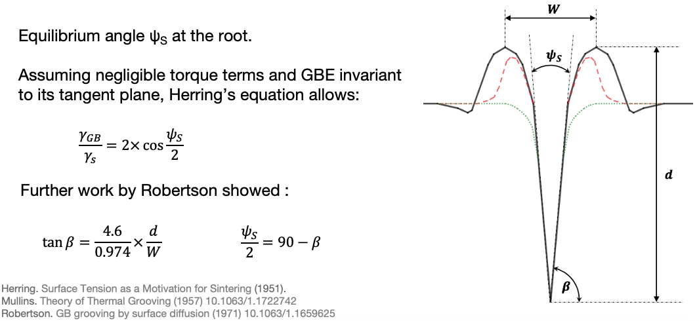

# AFMgrooves
MATLAB tool developed for the analysis of thermally grooved grain boundaries. It analyzes .nid Nanosurf AFM files and .xyz files exported from Gwyddion.

## Installation
To install this package, simply clone the GitHub repository in MATLAB using Source Control > Clone Git Repository, and using URL = https://github.com/lamr18/AFMgrooves.

Make sure to add the 'MATLAB' folder to your MATLAB path.

## Function
This package has been developed to facilitate the analysis of thermally grooved grain boundaries and of their energy. The usual manual method for this measurement is tedious, time consumming and can give rise to error from inaccuracies in drawing perpendicular lines. Instead, this package simplifies the process and removes user errors.

The interest in thermally grooved grain boundaries stems from their relation to grain boundary energy. The geometry of a thermally grooved grain boundary can be used to calculate the grain boundary energy to surface energy ratio, as explained below. This is what the package sets out to automate. 

Profiles across grain boundaries can be analyzed in two different ways: either one GBE ratio can be extracted from a symmetric profile, or two GBE ratios can be extracted from an asymmetric profile, as depicted below.

The overall workflow of the package is quite simple, and can be broken down into 4 stages.

## Usage
The package provides an automated solution to GB groove analysis in the form of the 'groove_analysis' function. This function is integrated within the package and calls the relevant functions.
All the functions in the package can be called independently by the  user. 

### Groove analysis
#### Inputs
The main function 'groove_analysis' takes input arguments:
`groove_analysis(filenamenid, filenamexyz, imageNo, gridsize, aspect_ratio, avpct, minpct,Nblines,line_half_length)`

- `filenamenid`: Path to file. Compulsory .nid file.
- `filenamexyz`: Path to file. Optional .xyz file if data treatement has been applied in Gwyddion (for optimal performance, only apply 'Mean Plane Substraction').
- `imageNo`: Integer. Which image is to be read from the file (must match the .xyz file if included).
- `gridsize`: Integer. Size of the n by n grid placed on the image to segment it, where n=gridsize. The larger the value, the smaller the area contained in each segment. As a general guide, the gridsize should be adjusted appropriately in function of the grain size and image size.
- `aspect_ratio`: True/False. This controls whether the segments are checked through the aspect ratio function. If this is enabled (`aspect_ratio=True`), only elongated features are recognized. Beware as this is a very sensitive function, and should only be enable after thorough optimization of the threshold parameters.
- `avpct`: Real number below 1, usually between 0.90 and 0.98. Used to skip segments where the min value is significantly higher than the average for the image. This is targetted to remove segments of the image that contain high plateaux or peaks.
- `minpct`: Real number above 1, usually between 1.01 and 1.2. Used to mask values that are far from the minimum of the segment. The shape of a thermally grooved grain boundary sees the GB running at the bottom, which will be detected as the minimum and not masked by the function.
- `Nblines`: Integer. Controls the number of lines drawn through each grain boundary line. 
- `line_half_length`: Integer. Controls the length in pixels of either side of a perpendicular line. This should be optimized to best suit the grain size and groove width.

It is recommended to optimize the threshold parameters prior to running the automated analysis using 'groove_analysis'. 

Example files and plots are provided in the 'Tutorial' folder.

#### Ouputs
The function outputs several plots:
- a 2D and a 3D view of the AFM image.
- a 2D plot of the GB detection mask, GB lines and perpendicular profile lines.
- four titled plots of different cumulative probability distributions calculated from the data.

